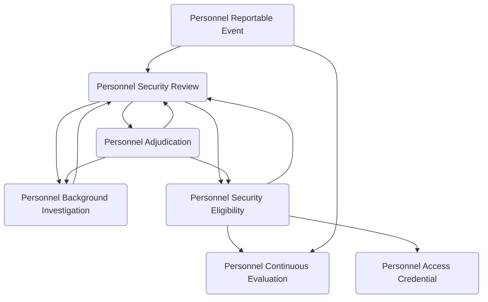

# 🔐 Personnel Security — Data Model Design

The **Personnel Security** module manages the lifecycle of evaluating, granting, monitoring, and enforcing trust-based access for individuals within an organization. It supports formal security reviews, background investigations, adjudication decisions, and the issuance of approved security eligibility levels. The module also enables ongoing oversight through continuous evaluation enrollment and the tracking of reportable events that may impact a person's access status. Operationally, it manages the issuance and status of access credentials tied to approved eligibility. Typical use cases include initial security vetting, clearance or trust renewals, eligibility upgrades, incident-triggered reviews, foreign travel or contact reporting, continuous monitoring programs, and badge or access credential management across government, defense, critical infrastructure, financial services, healthcare, and other regulated environments.

---

## Security Review & Investigation

### Personnel Security Review
Represents the lifecycle container for evaluating a person's suitability for a security eligibility decision. Used to track initial reviews, renewals, upgrades, reciprocity evaluations, or incident-triggered reviews from initiation through investigation, adjudication, and final outcome.

**Fields:**
- Name: Text
- Review Number: Text
- Person: Lookup (Person)
- Review Type: Choice (Security Review Type)
- Review Status: Choice (Security Review Status)
- Review Priority: Choice (Priority)
- Review Reason: Choice (Security Review Reason)
- Requested By: Lookup (Person)
- Request Date: Date
- Requested Clearance Level: Lookup (Clearance Level)
- Current Clearance Level: Lookup (Clearance Level)
- Position Requiring Eligibility: Lookup (Position)
- Organization Unit: Lookup (Organization Unit)
- Review Initiation Date: Date
- Target Completion Date: Date
- Actual Completion Date: Date
- Investigation Required: Yes / No
- Investigative Authority: Text
- Investigative Standards: Text
- Adjudicating Authority: Text
- Adjudicator: Lookup (Person)
- Primary Reviewer: Lookup (Person)
- Security Manager: Lookup (Person)
- Review Scope: Memo
- Special Circumstances: Memo
- Risk Indicators Summary: Memo
- Reciprocity Source: Text
- Reciprocity Acceptance: Yes / No
- Reciprocity Evaluation Date: Date
- Interim Eligibility Requested: Yes / No
- Interim Eligibility Granted: Yes / No
- Interim Eligibility Date: Date
- Interim Eligibility Expiration Date: Date
- Final Outcome: Choice (Security Review Outcome)
- Final Outcome Date: Date
- Review Completion Notes: Memo
- Appeal Filed: Yes / No
- Appeal Date: Date
- Appeal Decision: Choice (Appeal Decision)
- Appeal Decision Date: Date
- Legal Authority: Lookup (Legal Authority)
- Compliance Framework: Lookup (Compliance Framework)
- Case File Location: Text
- Case File Number: Text
- Supporting Document: Lookup (Document)
- Notes: Memo

---

### Personnel Background Investigation
Represents a formal investigative effort conducted to support a personnel security determination. Tracks the type, scope, provider, and status of the investigation and may include investigative activities, interviews, and records checks.

**Fields:**
- Name: Text
- Investigation Number: Text
- Personnel Security Review: Lookup (Personnel Security Review)
- Person: Lookup (Person)
- Investigation Type: Choice (Investigation Type)
- Investigation Tier: Choice (Investigation Tier)
- Investigation Status: Choice (Investigation Status)
- Investigation Scope: Choice (Investigation Scope)
- Requested Clearance Level: Lookup (Clearance Level)
- Initiated Date: Date
- Initiated By: Lookup (Person)
- Initiating Organization Unit: Lookup (Organization Unit)
- Investigation Provider: Lookup (Account)
- Investigation Provider Type: Choice (Investigation Provider Type)
- Investigator Assigned: Lookup (Person)
- Assignment Date: Date
- Coverage Start Date: Date
- Coverage End Date: Date
- Records Check Start Date: Date
- Records Check End Date: Date
- Field Work Start Date: Date
- Field Work End Date: Date
- Number of Interviews: Integer
- Number of References: Integer
- Number of Employers Contacted: Integer
- Number of Records Checked: Integer
- Target Completion Date: Date
- Actual Completion Date: Date
- Submitted Date: Date
- Received Date: Date
- Quality Review Date: Date
- Quality Reviewer: Lookup (Person)
- Quality Review Status: Choice (Quality Review Status)
- Quality Review Notes: Memo
- Issues Identified: Yes / No
- Issues Summary: Memo
- Derogatory Information: Yes / No
- Derogatory Summary: Memo
- Favorable Indicators: Memo
- Investigation Cost: Currency
- Investigation Report: Lookup (Document)
- Investigation Case File: Text
- Verified By: Lookup (Person)
- Verification Date: Date
- Notes: Memo

---

### Personnel Adjudication
Represents the formal decision made as part of a personnel security review. Captures the determination outcome (e.g., favorable, unfavorable, conditional), decision authority, decision date, and rationale associated with a background investigation or security review.

**Fields:**
- Name: Text
- Adjudication Number: Text
- Personnel Security Review: Lookup (Personnel Security Review)
- Personnel Background Investigation: Lookup (Personnel Background Investigation)
- Person: Lookup (Person)
- Adjudication Status: Choice (Adjudication Status)
- Adjudication Type: Choice (Adjudication Type)
- Adjudication Date: Date
- Adjudicator: Lookup (Person)
- Adjudicating Authority: Text
- Adjudicating Organization Unit: Lookup (Organization Unit)
- Review Panel Members: Text
- Requested Clearance Level: Lookup (Clearance Level)
- Current Clearance Level: Lookup (Clearance Level)
- Adjudicated Clearance Level: Lookup (Clearance Level)
- Adjudication Decision: Choice (Adjudication Decision)
- Decision Date: Date
- Decision Rationale: Memo
- Decision Summary: Memo
- Favorable Factors: Memo
- Unfavorable Factors: Memo
- Mitigating Factors: Memo
- Risk Assessment: Memo
- Conditions Applied: Yes / No
- Conditions Description: Memo
- Conditions Effective Date: Date
- Conditions Expiration Date: Date
- Restrictions Applied: Yes / No
- Restrictions Description: Memo
- Limitations Applied: Yes / No
- Limitations Description: Memo
- Security Concerns Identified: Memo
- Guideline Citations: Text
- Legal Authority: Lookup (Legal Authority)
- Policy Reference: Text
- Appeal Rights Notice Date: Date
- Appeal Deadline Date: Date
- Formal Decision: Lookup (Formal Decision)
- Decision Document: Lookup (Document)
- Adjudication Report: Lookup (Document)
- Supporting Document: Lookup (Document)
- Notification Sent: Yes / No
- Notification Date: Date
- Acknowledgment Received: Yes / No
- Acknowledgment Date: Date
- Notes: Memo

---

## Eligibility & Monitoring

### Personnel Security Eligibility
Represents the approved level of trust, clearance, or access authorization granted to a person following adjudication. Tracks eligibility type, level, effective date, expiration date, status, and the review that resulted in the determination.

**Fields:**
- Name: Text
- Eligibility Number: Text
- Person: Lookup (Person)
- Personnel Security Review: Lookup (Personnel Security Review)
- Clearance Level: Lookup (Clearance Level)
- Eligibility Type: Choice (Eligibility Type)
- Eligibility Status: Choice (Eligibility Status)
- Eligibility Category: Choice (Eligibility Category)
- Granted Date: Date
- Effective Date: Date
- Expiration Date: Date
- Days Until Expiration: Integer
- Reinvestigation Due Date: Date
- Periodic Review Due Date: Date
- Granted By: Lookup (Person)
- Granting Authority: Text
- Granting Organization Unit: Lookup (Organization Unit)
- Access Level: Text
- Compartmented Access: Yes / No
- Compartments Authorized: Text
- Special Access Programs: Text
- Special Access Indoctrination Date: Date
- Foreign Government Information Access: Yes / No
- Foreign Government Approvals: Text
- Sensitive Compartmented Information: Yes / No
- SCI Indoctrination Date: Date
- SCI Debriefing Required: Yes / No
- Interim Eligibility: Yes / No
- Interim Granted Date: Date
- Interim Expiration Date: Date
- Conditions Applied: Yes / No
- Conditions Description: Memo
- Limitations Applied: Yes / No
- Limitations Description: Memo
- Suspensions Count: Integer
- Last Suspension Date: Date
- Revocations Count: Integer
- Last Status Change Date: Date
- Status Change Reason: Memo
- Continuous Evaluation Enrollment: Yes / No
- Continuous Evaluation Start Date: Date
- Employment Position: Lookup (Position)
- Primary Work Location: Lookup (Location)
- Sponsoring Organization Unit: Lookup (Organization Unit)
- Security Manager: Lookup (Person)
- Legal Authority: Lookup (Legal Authority)
- Policy Reference: Text
- Certification Number: Text
- Verification Code: Text
- Certificate Document: Lookup (Document)
- Indoctrination Document: Lookup (Document)
- Supporting Document: Lookup (Document)
- Notes: Memo

---

### Personnel Continuous Evaluation
Represents enrollment in ongoing monitoring or recurring vetting processes following an approved security eligibility. Used to track automated record checks, recurring reviews, or continuous monitoring programs designed to identify new risk indicators over time.

**Fields:**
- Name: Text
- Enrollment Number: Text
- Person: Lookup (Person)
- Personnel Security Eligibility: Lookup (Personnel Security Eligibility)
- Continuous Evaluation Status: Choice (Continuous Evaluation Status)
- Continuous Evaluation Type: Choice (Continuous Evaluation Type)
- Enrollment Date: Date
- Enrollment Reason: Choice (Enrollment Reason)
- Enrolled By: Lookup (Person)
- Effective Start Date: Date
- Effective End Date: Date
- Program Name: Text
- Program Administrator: Text
- Evaluation Frequency: Choice (Evaluation Frequency)
- Last Evaluation Date: Date
- Next Evaluation Date: Date
- Automated Checks Enabled: Yes / No
- Automated Check Frequency: Choice (Automated Check Frequency)
- Financial Records Check: Yes / No
- Criminal Records Check: Yes / No
- Credit Records Check: Yes / No
- Travel Records Check: Yes / No
- Foreign Contact Check: Yes / No
- Social Media Monitoring: Yes / No
- Insider Threat Indicators: Yes / No
- Alerts Count: Integer
- Last Alert Date: Date
- Last Alert Summary: Memo
- Issues Identified: Yes / No
- Issue Summary: Memo
- Review Triggered: Yes / No
- Triggered Review: Lookup (Personnel Security Review)
- Monitoring Authority: Text
- Privacy Notice Provided: Yes / No
- Privacy Notice Date: Date
- Consent Obtained: Yes / No
- Consent Date: Date
- Privacy Consent: Lookup (Privacy Consent)
- Legal Authority: Lookup (Legal Authority)
- Policy Reference: Text
- Program Documentation: Lookup (Document)
- Notes: Memo

---

### Personnel Reportable Event
Represents an event or circumstance that may impact a person's security eligibility or access status. Examples include foreign travel, foreign contact, legal incidents, financial issues, or other policy-defined reportable matters. These events may trigger a new personnel security review.

**Fields:**
- Name: Text
- Event Number: Text
- Person: Lookup (Person)
- Event Type: Choice (Reportable Event Type)
- Event Category: Choice (Reportable Event Category)
- Event Status: Choice (Event Status)
- Event Date: Date
- Event Date Time: Date Time
- Reported Date: Date Time
- Reported By: Lookup (Person)
- Report Method: Choice (Method of Contact)
- Event Description: Memo
- Event Location: Lookup (Location)
- Event Country: Text
- Foreign Travel Destination: Text
- Foreign Travel Start Date: Date
- Foreign Travel End Date: Date
- Foreign Travel Purpose: Text
- Foreign Contact Name: Text
- Foreign Contact Country: Text
- Foreign Contact Type: Choice (Foreign Contact Type)
- Foreign Contact Description: Memo
- Financial Issue Type: Choice (Financial Issue Type)
- Financial Issue Description: Memo
- Legal Incident Type: Choice (Legal Incident Type)
- Legal Incident Description: Memo
- Arrest Date: Date
- Citation Number: Text
- Court Case Number: Text
- Adverse Action Type: Choice (Adverse Action Type)
- Adverse Action Description: Memo
- Security Concern Level: Choice (Security Concern Level)
- Immediate Threat: Yes / No
- Threat Assessment: Memo
- Reviewed By: Lookup (Person)
- Review Date: Date
- Review Notes: Memo
- Mitigation Actions: Memo
- Security Manager Notified: Yes / No
- Notification Date: Date Time
- Triggered Security Review: Yes / No
- Related Security Review: Lookup (Personnel Security Review)
- Related Continuous Evaluation: Lookup (Personnel Continuous Evaluation)
- Impact on Eligibility: Choice (Impact Level)
- Eligibility Action Taken: Choice (Eligibility Action)
- Action Taken Date: Date
- Action Taken By: Lookup (Person)
- Resolution Date: Date
- Resolution Status: Choice (Resolution Status)
- Resolution Summary: Memo
- Legal Authority: Lookup (Legal Authority)
- Policy Reference: Text
- Supporting Document: Lookup (Document)
- Incident Report: Lookup (Document)
- Notes: Memo

---

## Access Credentials

### Personnel Access Credential
Represents a physical or logical access artifact issued to a person based on approved security eligibility. Used to track badges, smart cards, mobile credentials, tokens, or other organization-issued access identifiers, including issuance, status, expiration, suspension, or revocation.

**Fields:**
- Name: Text
- Credential Number: Text
- Credential Type: Choice (Access Credential Type)
- Person: Lookup (Person)
- Personnel Security Eligibility: Lookup (Personnel Security Eligibility)
- Credential Status: Choice (Credential Status)
- Credential Category: Choice (Credential Category)
- Issue Date: Date
- Expiration Date: Date
- Days Until Expiration: Integer
- Effective Start Date: Date
- Effective End Date: Date
- Issued By: Lookup (Person)
- Issuing Organization Unit: Lookup (Organization Unit)
- Issuing Authority: Text
- Badge Number: Text
- Card Number: Text
- Serial Number: Text
- RFID Tag: Text
- Biometric Enrolled: Yes / No
- Biometric Type: Choice (Biometric Type)
- Biometric Enrollment Date: Date
- PIN Required: Yes / No
- PIN Last Changed Date: Date
- Photo Attached: Yes / No
- Photo Capture Date: Date
- Access Level: Text
- Access Zones Authorized: Text
- Building Access: Yes / No
- Facility Access: Yes / No
- System Access: Yes / No
- Network Access: Yes / No
- Restricted Area Access: Yes / No
- Temp Credential: Yes / No
- Temp Credential Reason: Memo
- Temp Credential Expiration Date: Date
- Clearance Level Required: Lookup (Clearance Level)
- Escort Required: Yes / No
- Escort Requirements: Memo
- Vehicle Access: Yes / No
- Vehicle Registration Number: Text
- Activation Date: Date Time
- Deactivation Date: Date Time
- Last Access Date Time: Date Time
- Access Count: Integer
- Suspensions Count: Integer
- Last Suspension Date: Date
- Suspension Reason: Memo
- Suspension Start Date: Date
- Suspension End Date: Date
- Revocation Date: Date
- Revocation Reason: Memo
- Revoked By: Lookup (Person)
- Return Required: Yes / No
- Return Date: Date
- Returned By: Lookup (Person)
- Return Method: Text
- Lost or Stolen: Yes / No
- Lost Stolen Date: Date
- Lost Stolen Report Number: Text
- Replacement Credential: Lookup (Personnel Access Credential)
- Replaced Credential: Lookup (Personnel Access Credential)
- Legal Authority: Lookup (Legal Authority)
- Policy Reference: Text
- Issuance Document: Lookup (Document)
- Photo Document: Lookup (Document)
- Supporting Document: Lookup (Document)
- Notes: Memo

---

## Reused Core Tables

The following Core tables are used directly by this module:

### Person *(Core)*
Subject of security reviews, investigations, adjudications, eligibility, monitoring, and credential issuance.

### Clearance Level *(Core)*
Security clearance levels requested, held, and granted.

### Organization Unit *(Core)*
Units initiating reviews, adjudicating, sponsoring eligibility, issuing credentials.

### Location *(Core)*
Work locations, event locations, facility access.

### Position *(Core)*
Positions requiring security eligibility.

### Legal Authority *(Core)*
Regulatory basis for security programs, investigations, adjudications.

### Compliance Framework *(Core)*
Frameworks governing security programs and investigations.

### Formal Decision *(Core)*
Formal adjudication decisions.

### Privacy Consent *(Core)*
Consent for continuous monitoring and investigations.

### Document *(Core)*
Investigation reports, adjudication decisions, certificates, supporting documentation.

### Account *(Core)*
Investigation providers, adjudicating authorities.

---

## New Choice Fields

### Security Review Type
- Initial Review
- Periodic Reinvestigation
- Upgrade Review
- Downgrade Review
- Reciprocity Evaluation
- Incident Triggered
- Renewal Review
- Transfer Review
- Position Change Review

### Security Review Status
- Initiated
- Investigation Pending
- Investigation In Progress
- Adjudication Pending
- Adjudication In Progress
- Completed
- Suspended
- Cancelled
- On Hold

### Security Review Reason
- Initial Clearance
- Periodic Reinvestigation
- Clearance Upgrade
- Position Requirements
- Reciprocity Transfer
- Reportable Event
- Adverse Information
- Policy Change
- Renewal Due
- Self Report

### Security Review Outcome
- Favorable
- Favorable with Conditions
- Unfavorable
- Interim Favorable
- Pending Additional Information
- No Determination
- Withdrawn
- Cancelled

### Appeal Decision
- Appeal Granted
- Appeal Denied
- Appeal Partially Granted
- Remanded for Review
- Withdrawn

### Investigation Type
- National Agency Check
- Background Investigation
- Enhanced Background Investigation
- Periodic Reinvestigation
- Limited Background Investigation
- Moderate Background Investigation
- Counterintelligence Investigation
- Special Background Investigation
- Reciprocity Review

### Investigation Tier
- Tier 1
- Tier 2
- Tier 3
- Tier 4
- Tier 5

### Investigation Status
- Requested
- Initiated
- In Progress
- Field Work
- Records Review
- Quality Review
- Completed
- Submitted
- Pending Correction
- Cancelled

### Investigation Scope
- Full Scope
- Limited Scope
- Records Only
- Enhanced Scope
- Abbreviated

### Investigation Provider Type
- Government Agency
- Contract Provider
- Internal
- Federal Investigative Service
- Third Party

### Quality Review Status
- Passed
- Passed with Notes
- Failed
- Pending Correction
- Re Investigation Required

### Adjudication Status
- Pending Review
- Under Review
- Panel Review
- Pending Decision
- Decision Issued
- Appeal Pending
- Final

### Adjudication Type
- Initial Adjudication
- Reinvestigation Adjudication
- Upgrade Adjudication
- Interim Adjudication
- Appeal Adjudication
- Reciprocity Adjudication

### Adjudication Decision
- Favorable
- Favorable with Conditions
- Favorable with Limitations
- Unfavorable
- Interim Favorable
- Interim Unfavorable
- Suspended
- Revoked
- Denied
- No Determination

### Eligibility Type
- Security Clearance
- Position of Trust
- Access Authorization
- Special Access
- Compartmented Access
- Interim Clearance

### Eligibility Status
- Active
- Expired
- Suspended
- Revoked
- Denied
- Pending Renewal
- Inactive
- Terminated

### Eligibility Category
- Confidential
- Secret
- Top Secret
- Sensitive
- Public Trust
- High Risk Public Trust

### Continuous Evaluation Status
- Active
- Inactive
- Suspended
- Pending Enrollment
- Terminated

### Continuous Evaluation Type
- Automated Monitoring
- Periodic Review
- Event Driven
- Risk Based
- Comprehensive

### Enrollment Reason
- New Eligibility
- Policy Requirement
- High Risk Position
- Voluntary Enrollment
- Incident Triggered

### Evaluation Frequency
- Continuous
- Daily
- Weekly
- Monthly
- Quarterly
- Annual
- Event Driven

### Automated Check Frequency
- Real Time
- Daily
- Weekly
- Monthly
- Quarterly

### Reportable Event Type
- Foreign Travel
- Foreign Contact
- Legal Incident
- Financial Issue
- Adverse Action
- Security Violation
- Mental Health Event
- Substance Issue
- Employment Change
- Residence Change
- Relationship Change
- Self Report

### Reportable Event Category
- Foreign Influence
- Criminal Conduct
- Financial Concern
- Substance Abuse
- Mental Health
- Personal Conduct
- Security Violation
- Allegiance Concern

### Event Status
- Reported
- Under Review
- Reviewed
- No Action Required
- Action Taken
- Closed

### Foreign Contact Type
- Family Member
- Close Associate
- Business Contact
- Casual Contact
- Romantic Relationship
- Foreign Government Official

### Financial Issue Type
- Delinquent Debt
- Bankruptcy
- Foreclosure
- Tax Issue
- Garnishment
- Collection Action
- Judgment
- Gambling Problem

### Legal Incident Type
- Arrest
- Citation
- Criminal Charge
- Civil Lawsuit
- Restraining Order
- Probation
- Parole
- Domestic Incident

### Adverse Action Type
- Termination
- Demotion
- Suspension
- Written Reprimand
- Security Violation
- Ethics Violation
- Policy Violation

### Security Concern Level
- Low
- Moderate
- High
- Critical

### Impact Level
- No Impact
- Minor Impact
- Moderate Impact
- Significant Impact
- Critical Impact

### Eligibility Action
- No Action
- Additional Review Ordered
- Suspension
- Revocation
- Restriction Applied
- Enhanced Monitoring

### Resolution Status
- Pending
- Under Investigation
- Resolved
- No Action Required
- Mitigated
- Unresolved

### Access Credential Type
- Badge
- Smart Card
- Proximity Card
- Mobile Credential
- Token
- Biometric
- Temporary Badge
- Contractor Badge
- Visitor Badge

### Credential Status
- Active
- Expired
- Suspended
- Revoked
- Lost
- Stolen
- Damaged
- Returned
- Replaced

### Credential Category
- Permanent
- Temporary
- Contractor
- Visitor
- Emergency
- Limited Access

### Biometric Type
- Fingerprint
- Facial Recognition
- Iris Scan
- Hand Geometry
- Voice Recognition
- Multiple Biometrics
